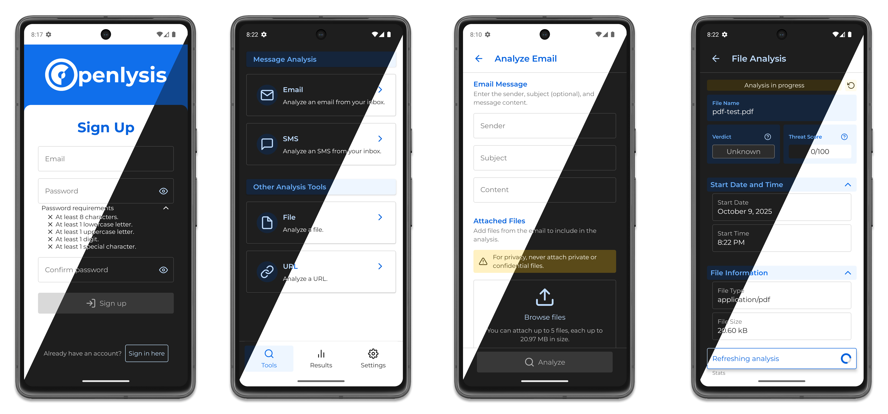
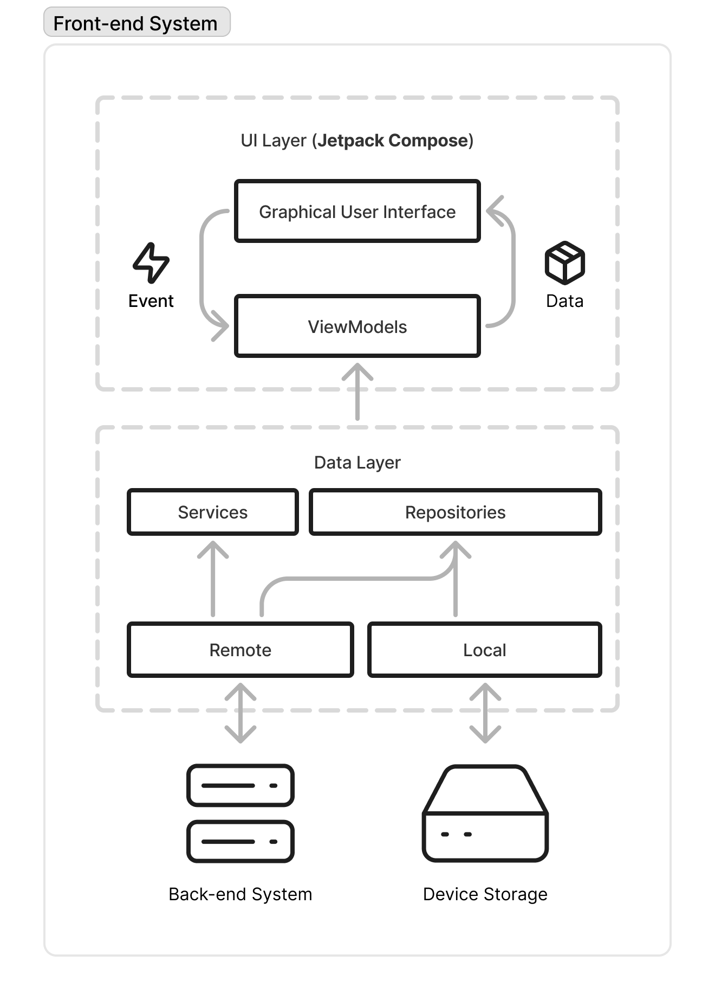

# Openlysis Android App

Openlysis is a comprehensive system designed to analyze files, URLs, SMS messages, and emails using external services such as VirusTotal, HybridAnalysis, Filescan, and Urlquery. Its primary goal is to fight phishing and smishing, with a focus on making security accessible to non-expert users. This Android app, compatible with API Level 24 (Android 7.0 Nougat) and above, works seamlessly with the [Openlysis Back-end System](https://github.com/PabloStarOk/openlysis).

## Table of Contents

1. [Features](#features)
2. [Architecture](#architecture)
3. [Technologies](#technologies)
4. [Getting Started](#getting-started)
5. [License](#license)

## Features

- Analyze files and URLs for threats using multiple external services.
- Extract and analyze URLs from SMS messages and emails.
- Detect incoming SMS messages for semi-automated analysis.
- Supports both light and dark appearance modes.
- Provides basic email and password authentication.
- Receives real-time analysis updates via SignalR.
- View analysis results.

### Screenshots



### Video Demo

A video showing basic usage (in Spanish only).

[](https://youtu.be/soo0FRt-_48)

## Architecture



This app uses the layered architecture proposed by Android Developers in the [Guide to app architecture](https://developer.android.com/topic/architecture).

- **UI Layer:** Defines the GUI components and screens the user sees and interacts with. This layer also follows the [Unidirectional Data Flow (UDF)](https://developer.android.com/topic/architecture#unidirectional-data-flow) pattern.
- **Data Layer:** Implements the core logic of the app, including services and repositories.

Following an offline-first philosophy, the app stores the 10 most recent analyses locally on the device.

## Technologies

- Jetpack Compose for UI development.
- Room for local database management.
- DataStore and Proto DataStore for key-value and typed data storage.
- Android Work Manager for background task scheduling.

## Getting Started

### Prerequisites

- A functional [Openlysis Back-end System](https://github.com/PabloStarOk/openlysis)
- [Android Studio](https://developer.android.com/studio)
- An emulator or physical device running Android API level 24 or higher.

### Clone the repository

```sh
git clone https://github.com/PabloStarOk/openlysis-android.git
cd openlysis-android
```

### Manifest for development

The default manifest requires HTTPS connections, which can complicate local development. Therefore, create the following files in `app/src/debug/` for development:

- An `AndroidManifest.xml` file that overrides the `usesCleartextTraffic` attribute.

```xml
<?xml version="1.0" encoding="utf-8"?>
<manifest xmlns:android="http://schemas.android.com/apk/res/android"
    xmlns:tools="http://schemas.android.com/tools"
    package="com.openlysis">

    <application
        android:usesCleartextTraffic="true"
        android:networkSecurityConfig="@xml/network_security_config"
        tools:replace="android:usesCleartextTraffic">
    </application>

</manifest>
```

- A `network_security_config.xml` file that sets `cleartextTrafficPermitted` to true.

```xml
<?xml version="1.0" encoding="utf-8"?>
<network-security-config>
    <base-config cleartextTrafficPermitted="true"/>
</network-security-config>
```

### Property files

To run the app, specify the required settings in a `settings.properties` file located at the root of the repository. Replace `[host]:[port]` with your backend server's address and port.

```properties
# Development variables
ANALYSIS_API_BASE_URL="http://[host]:[port]/api/v1/"
AUTH_API_BASE_URL="http://[host]:[port]/api/v1/"
ANALYSIS_UPDATES_SIGNALR_HUB_URL="http://[host]:[port]/hubs/analysis-updates"
MAX_ATTACHMENT_FILES=5
MAX_ATTACHMENT_FILE_SIZE_BYTES=20971520l

# Production variables
ANALYSIS_API_BASE_URL_PROD="http://[host]:[port]/api/v1/"
AUTH_API_BASE_URL_PROD="http://[host]:[port]/api/v1/"
ANALYSIS_UPDATES_SIGNALR_HUB_URL_PROD="http://[host]:[port]/hubs/analysis-updates"
MAX_ATTACHMENT_FILES_PROD=5
MAX_ATTACHMENT_FILE_SIZE_BYTES_PROD=52428800l
```

## License

This project is open-source and available under the [MIT License](/LICENSE.md).
